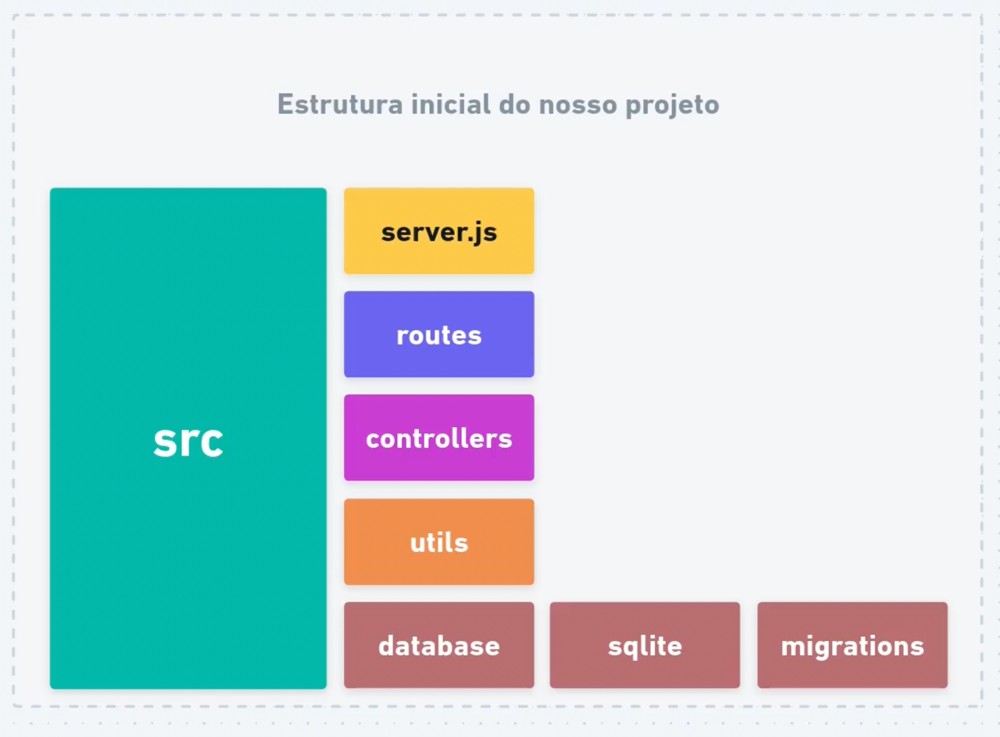
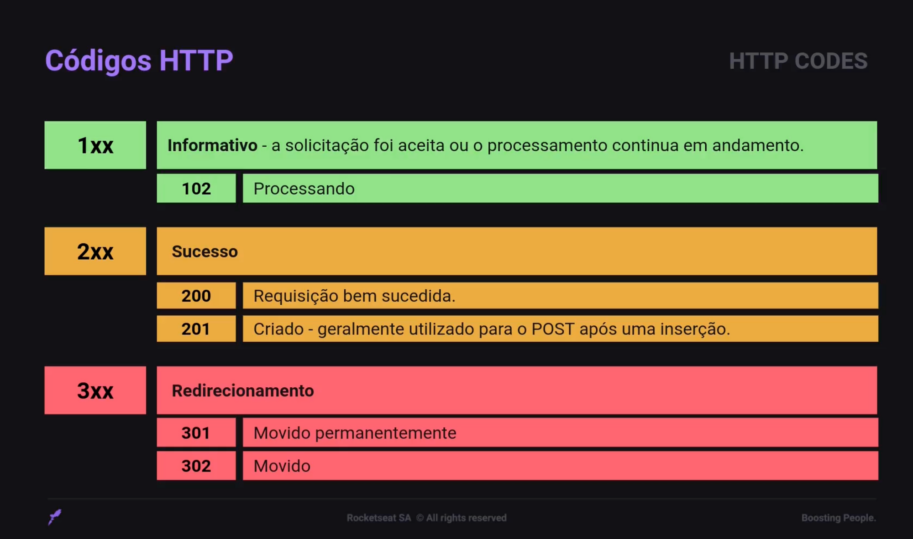
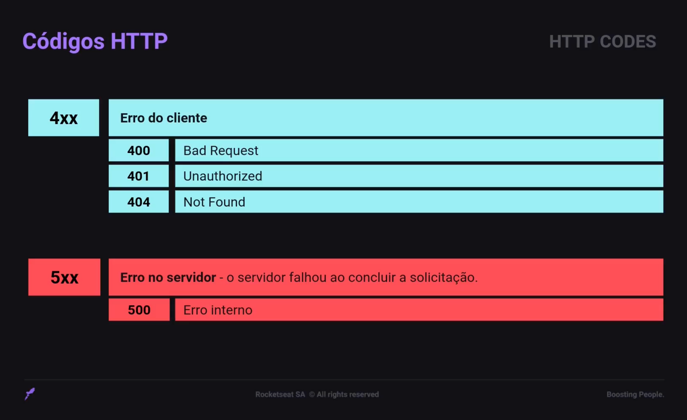

# explorer-project-12

## Introduction a nodejs

learn about http methods and their meanings
(GET, POST, PUT, DELETE, PATCH)

learned about GET:
route params and query params

---

learned about POST:
body params with request and response

---

learned about architecture used in this project:

---

learned about HTTP codes:

